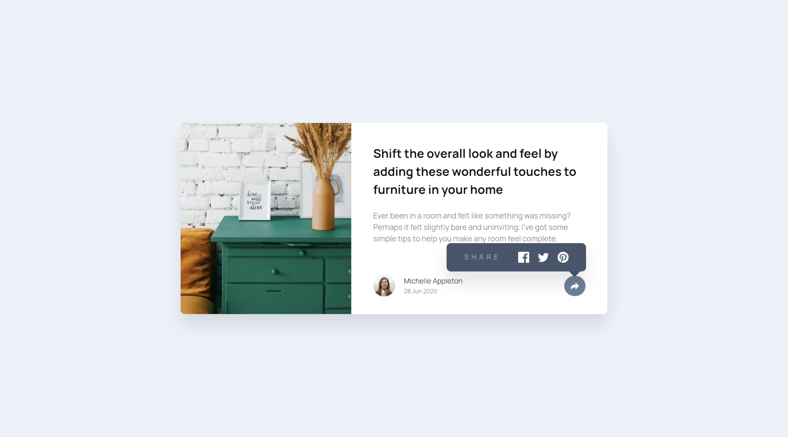

# Frontend Mentor - Article Preview Component Solution

This is a solution to the [Article Preview Component challenge on Frontend Mentor](https://www.frontendmentor.io/challenges/article-preview-component-dYBN_pYFT). Frontend Mentor challenges help you improve your coding skills by building realistic projects.

## Table of contents

- [Overview](#overview)
  - [The challenge](#the-challenge)
  - [Screenshot](#screenshot)
  - [Links](#links)
- [My process](#my-process)
  - [Built with](#built-with)
  - [What I learned](#what-i-learned)
- [Author](#author)

## Overview

### The challenge

Users should be able to:

- View the optimal layout for the component depending on their device's screen size
- See the social media share links when they click the share icon

### Screenshot

### Links

- Solution URL: [Source Code for my Article Preview Component Solution](https://github.com/thomasweitzel/frontend-mentor/tree/main/article-preview-component)
- Live Site URL: [Live Demo for my Article Preview Component Solution](https://pureandroid.com/frontendmentor/article-preview-component/)

## My process

### Built with

- Semantic HTML5 markup
- [Tailwind CSS](https://tailwindcss.com/) 3.0 utility classes
- [React](https://reactjs.org/) - JS library
- [Rsbuild](https://rsbuild.dev/) - Rspack Powered Build Tool

### What I learned

- How to use the grid layout effectively for several media breakpoints.
- How to employ `grid-template-areas` and `grid-area` to arrange elements in a grid.
- Use and positioning of a background image with CSS.
- Using the flex layout for arranging elements within the testimonials.

## Author

- Website - [Thomas Weitzel](https://weitzel.dev/)
- Frontend Mentor - [@thomasweitzel](https://www.frontendmentor.io/profile/thomasweitzel)
- BlueSky - [@weitzel.dev](https://bsky.app/profile/weitzel.dev)
