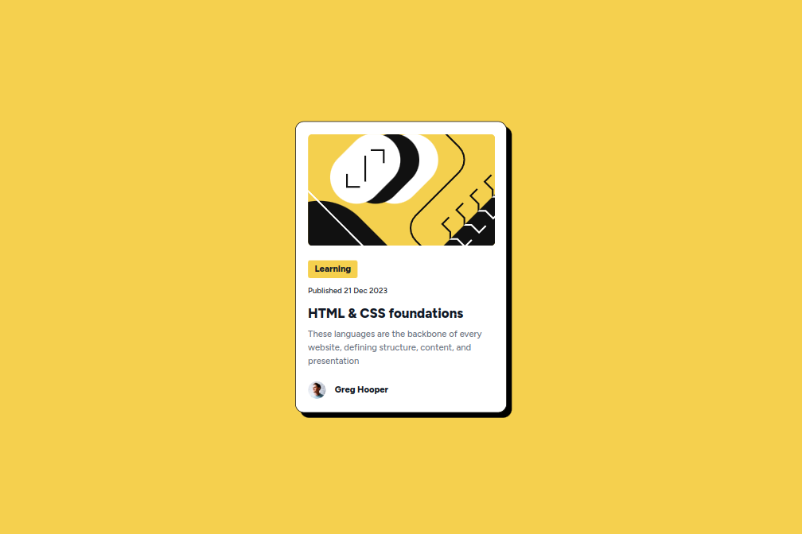

# Frontend Mentor - Blog Preview Card Solution

This is a solution to the [Blog Preview Card Challenge on Frontend Mentor](https://www.frontendmentor.io/challenges/qr-code-component-iux_sIO_H). Frontend Mentor challenges help you improve your coding skills by building realistic projects.

## Table of contents

- [Overview](#overview)
  - [Screenshot](#screenshot)
  - [Links](#links)
- [My process](#my-process)
  - [Built with](#built-with)
  - [What I learned](#what-i-learned)
- [Author](#author)

## Overview

### Screenshot

### Links

- Solution URL: [My Source Code for the Blog Preview Card Challenge](https://github.com/thomasweitzel/frontend-mentor/tree/main/blog-preview-card)
- Live Site URL: [My Live Solution for the Blog Preview Card Challenge](https://pureandroid.com/frontendmentor/blog-preview-card/)

## My process

Even though the project only requires plain HTML and CSS, it's built as a React application with Tailwind CSS and Rsbuild.
I do this because I think this setup will benefit me and my projects in the future. 

### Built with

- Semantic HTML5 markup
- [Tailwind CSS](https://tailwindcss.com/) 3.0 utility classes
- [React](https://reactjs.org/) - JS library
- [Rsbuild](https://rsbuild.dev/) - Rspack Powered Build Tool

### What I learned

- How to use responsive modifiers like `sm:` and `lg`.
- How to use state modifiers like `hover:`, `focus`, or `disabled`

## Author

- Website - [Thomas Weitzel](https://weitzel.dev/)
- Frontend Mentor - [@thomasweitzel](https://www.frontendmentor.io/profile/thomasweitzel)
- BlueSky - [@weitzel.dev](https://bsky.app/profile/weitzel.dev)
