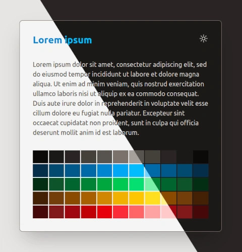

# Dark Theme Toggle with Tailwind

Version 4 simplifies dark mode implementation in React, leveraging modern theming and automatic opacity handling for
colors. I use local storage to persist user preferences across sessions

The ability to toggle between light and dark themes is a key feature in modern web applications.
With [Tailwind CSS](https://tailwindcss.com/) 4.0, implementing this functionality has become significantly easier
compared to earlier versions like 3.4. The latest version simplifies theming, eliminates the need for manual opacity
handling, and integrates seamlessly with React.

In this blog post, I’ll build a dark theme toggle in a React application using Tailwind CSS 4.0, explain why local
storage is essential, and highlight how the current Tailwind 4.0 beta improves over 3.4.

You can have a look at the [live demo](https://thomasweitzel.github.io/frontend-mentor/color-theme-toggle/dist/) or
the [project on GitHub](https://github.com/thomasweitzel/frontend-mentor/tree/main/color-theme-toggle). Here is how it
should look like in both modes:



## What’s New in Tailwind CSS 4.0?

Tailwind CSS 4.0 introduces significant improvements to theming:

- `@theme` Directive: You can now declare your theme variables directly in the CSS file, removing the need for
  extensive `tailwind.config.js` setup.
- Automatic Opacity Handling: Opacity is automatically integrated into colors, so you don’t need to manually manage
  `rgb` or `rgba` conversions as in earlier versions.
- Better Integration with Modern Frontend Tools: Tailwind 4.0 works more naturally with frameworks like React,
  allowing dynamic updates like theme toggling with minimal configuration.

Here’s how we take advantage of these features to implement our theme toggle.

## Setting Up the Theme in Tailwind CSS 4.0

In our project, we define theme variables directly in `src/App.css` using the `@theme` directive. This eliminates the
need for extending Tailwind's configuration in a separate file. I just chose the colors randomly because they only serve
as examples.

### src/App.css

```css
@import "tailwindcss";

@theme {
    --color-*: initial;
    /* Default theme light */
    --color-neutral-50:  oklch(0.147 0.004  49.250);
    --color-neutral-100: oklch(0.216 0.006  56.043);
    --color-neutral-200: oklch(0.268 0.007  34.298);
    --color-neutral-300: oklch(0.374 0.010  67.558);
    --color-neutral-400: oklch(0.444 0.011  73.639);
    /* ... */
}

@layer base {
    [data-theme="dark"] {
        --color-neutral-50:  oklch(0.985 0.001 106.423);
        --color-neutral-100: oklch(0.970 0.001 106.424);
        --color-neutral-200: oklch(0.923 0.003  48.717);
        --color-neutral-300: oklch(0.869 0.005  56.366);
        --color-neutral-400: oklch(0.709 0.010  56.259);
        /* ... */
    }
}

:root {
    background-color: var(--color-neutral-950);
}
```

The plan here is to set the `data-theme` attribute of the `<html>` element to `dark` when the dark mode is selected. If
the `light` mode is used, the attribute is set to `light`. Since we have two sets of colors in the CSS file, the default
set is selected when the attribute is absent or has another value than `dark`. If the attribute has the value `dark`,
then the alternative color set is used:

- Light Theme: Default values for colors are defined in the `@theme` block.
- Dark Theme: Dynamically overrides the light theme when the `data-theme="dark"` attribute is present on the
  `<html>` element.

This approach is declarative and keeps theme-related styling in one place. We can now use the colors `neutral-100`,
`primary-200`, `ok-300`, `warn-400`, or `fail-500` with any of the color prefixes, like `bg-`, `text-`, or
`border-`. Opacity is also built-in, we can use it like that: `text-primary-200/50`.

## Implementing the Theme Toggle in React

The `src/component/card.jsx` file handles the dynamic toggling of the dark theme. Here’s a breakdown of how it works:

### src/component/card.jsx

```jsx
import React, { useLayoutEffect, useState } from "react";

const APPLICATION_NAME = "color-theme-toggle";

// Inline SVG so we can take advantage of currentColor (text-color)
const SvgImage = ({ src }) => {
  const svgContent = atob(src.split(",")[1]);
  return <div dangerouslySetInnerHTML={{ __html: svgContent }} />;
};

const Card = ({ card }) => {
  const lightTheme = "light";
  const darkTheme = "dark";

  const getDataTheme = (theme) => theme === darkTheme ? darkTheme : lightTheme;
  const getToggledTheme = (theme) => theme === darkTheme ? lightTheme : darkTheme;

  const initialTheme = localStorage.getItem(APPLICATION_NAME) || lightTheme;
  const [theme, setTheme] = useState(initialTheme);

  useLayoutEffect(() => {
    document.documentElement.setAttribute("data-theme", getDataTheme(theme));
  }, [theme]);

  const toggleTheme = () => {
    const newTheme = getToggledTheme(theme);
    setTheme(newTheme);
    localStorage.setItem(APPLICATION_NAME, getDataTheme(newTheme));
  };

  const { darkIcon, lightIcon, heading, text } = card;
  const icons = { dark: lightIcon, light: darkIcon };

  return (
    <div className="flex min-h-screen min-w-full flex-col items-center justify-center">
      <article
        className="relative w-[80%] max-w-[500px] rounded-lg border border-neutral-500 bg-neutral-900 p-8 shadow-2xl text-neutral-300">
        <div onClick={toggleTheme} className="absolute top-0 right-0 mr-8 mt-8 cursor-pointer w-6 h-6">
          <SvgImage src={icons[theme]} />
        </div>
        <h1 className="text-2xl font-bold text-primary-400">{heading}</h1>
        <p className=" py-8">{text}</p>
        <div className={"grid grid-cols-11 gap-[2px]"}>
          {["neutral", "primary", "ok", "warn", "fail"].map((color, colorIndex) => (
            ["50", "100", "200", "300", "400", "500", "600", "700", "800", "900", "950"].map((tone, toneIndex) => (
              <div key={`key-${colorIndex}-${toneIndex}`} className={`bg-${color}-${tone} m-0 p-0 h-8`}></div>
            ))
          ))}
        </div>
      </article>
    </div>
  );
};

export default Card;
```

## Initialize Theme Based on Local Storage  

When the component mounts, it checks `localStorage` for a saved theme:
   
```jsx
const initialTheme = localStorage.getItem(APPLICATION_NAME) || lightTheme;
const [theme, setTheme] = useState(initialTheme);
```

If no theme was saved, the light theme is used as the default.

## Toggle Theme Dynamically  

The `toggleTheme` function toggles between light and dark themes:

```jsx
const newTheme = getToggledTheme(theme);
setTheme(newTheme);
localStorage.setItem(APPLICATION_NAME, getDataTheme(newTheme));
```

- The `data-theme` attribute is set for the `<html>` element.
- `localStorage` is updated to persist the user's preference.

## Tailwind CSS 4.0 vs. previous versions

### Simpler Theming with @theme

In Tailwind 3.4, you needed to extend `tailwind.config.js` with `extend` blocks to define custom properties and manually
manage theme variables. This separated theme logic from styles, making it harder to maintain.

Themes are defined directly in CSS in Tailwind 4.0, using the `@theme` directive. This keeps everything centralized and
declarative.

### Automatic Opacity Handling

In Tailwind 3.4, you had to manually handle opacity with `rgb(var(--color-variable) / <alpha-value>)`. This required
additional configuration for custom colors.

Opacity is automatically integrated into colors in Tailwind 4.0. For example, `text-primary-200/50` adjusts the text
color's opacity to 50% without requiring extra setup.

### Seamless Integration with React

Tailwind 4.0's improved theming and opacity handling simplifies React integration.
Dynamic updates, like toggling `data-theme`, feel natural and require minimal configuration.

Dark theme toggling in React applications with Tailwind CSS 4.0 is straightforward. With the `@theme` directive,
automatic opacity handling, and declarative CSS, it removes the boilerplate required in 3.4. By combining these features
with local storage, our implementation ensures a consistent and personalized user experience across sessions.

Tailwind CSS 4.0 is a clear step forward for developers, offering simplicity, flexibility, and modern tools to build
awesome, accessible web applications. If you’re still on an older version, it’s time to upgrade and experience the
difference! As of the date I'm writing this post, Tailwind CSS 4.0 is still in beta, but it already looks good and will
eventually become stable.

While I have used only two color sets for two different color themes here, you can extend this approach to support as
many themes as you like. Once the work of defining custom colors and using them is completed, there is no need to change
any of the Tailwind utility classes used in the React components anymore.
