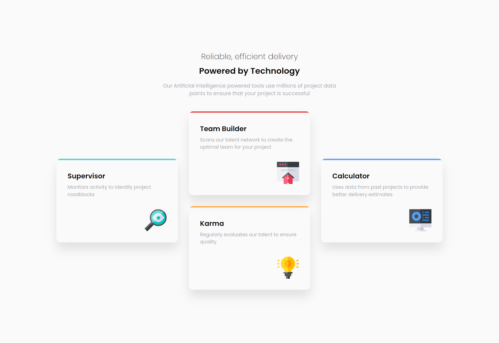

# Frontend Mentor - Four Card Feature Section Solution

This is a solution to the [Four card feature section challenge on Frontend Mentor](https://www.frontendmentor.io/challenges/four-card-feature-section-weK1eFYK).
Frontend Mentor challenges help you improve your coding skills by building realistic projects.

## Table of contents

- [Overview](#overview)
  - [The challenge](#the-challenge)
  - [Screenshot](#screenshot)
  - [Links](#links)
- [My process](#my-process)
  - [Built with](#built-with)
  - [What I learned](#what-i-learned)
- [Author](#author)

## Overview

### The challenge

Users should be able to:

- View the optimal layout for the site depending on their device's screen size

### Screenshot

### Links

- Solution URL: [Source Code for my Four Card Feature Section Solution](https://github.com/thomasweitzel/frontend-mentor/tree/main/four-card-feature-section)
- Live Site URL: [Live Demo for my Four Card Feature Section Solution](https://pureandroid.com/frontendmentor/four-card-feature-section/)

## My process

### Built with

- Semantic HTML5 markup
- [Tailwind CSS](https://tailwindcss.com/) 3.0 utility classes
- [React](https://reactjs.org/) - JS library
- [Rsbuild](https://rsbuild.dev/) - Rspack Powered Build Tool

### What I learned

- A lot about Grid and Flex layouts
- How to align and justify elements with their layouts
- That I still need way more practice with these layouts to be more comfortable with them
- I do not know enough yet to solve this challenge without resorting to JavaScript;
  the challenge was labeled HTML & CSS, but I had to use JavaScript to partition the cards for the grid layout

## Author

- Website - [Thomas Weitzel](https://weitzel.dev/)
- Frontend Mentor - [@thomasweitzel](https://www.frontendmentor.io/profile/thomasweitzel)
- BlueSky - [@weitzel.dev](https://bsky.app/profile/weitzel.dev)
