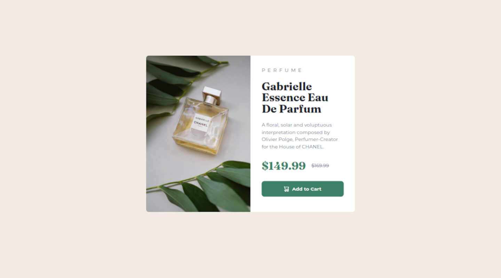

# Frontend Mentor - Product Preview Card Component Solution

This is a solution to
the [Product preview card component challenge on Frontend Mentor](https://www.frontendmentor.io/challenges/product-preview-card-component-GO7UmttRfa).
Frontend Mentor challenges help you improve your coding skills by building realistic projects.

## Table of contents

- [Overview](#overview)
  - [The challenge](#the-challenge)
  - [Screenshot](#screenshot)
  - [Links](#links)
- [My process](#my-process)
  - [Built with](#built-with)
  - [What I learned](#what-i-learned)
- [Author](#author)

**Note: Delete this note and update the table of contents based on what sections you keep.**

## Overview

### The challenge

Users should be able to:

- View the optimal layout depending on their device's screen size
- See hover and focus states for interactive elements

### Screenshot

### Links

- Solution URL: [Source Code for my Product Preview Card Solution](https://github.com/thomasweitzel/frontend-mentor/tree/main/product-preview-card)
- Live Site URL: [Live Demo for my Product Preview Card Solution](https://pureandroid.com/frontendmentor/product-preview-card/)

## My process

### Built with

- Semantic HTML5 markup
- [Tailwind CSS](https://tailwindcss.com/) 3.0 utility classes
- [React](https://reactjs.org/) - JS library
- [Rsbuild](https://rsbuild.dev/) - Rspack Powered Build Tool

### What I learned

- Correct handling of breakpoints for a <something>-first approach:
  you do not include the qualifiers for this "something" in your markup.
- How to add accessibility information in the markup (`aria` - Accessible Rich Internet Applications).
- I'm starting to grasp how this whole "responsive" thing works;
  I started Kevin Powell's free online course [Conquering Responsive Layouts](https://courses.kevinpowell.co/view/courses/conquering-responsive-layouts),
  even though it's spread out over 21 days.

## Author

- Website - [Thomas Weitzel](https://weitzel.dev/)
- Frontend Mentor - [@thomasweitzel](https://www.frontendmentor.io/profile/thomasweitzel)
- BlueSky - [@weitzel.dev](https://bsky.app/profile/weitzel.dev)
