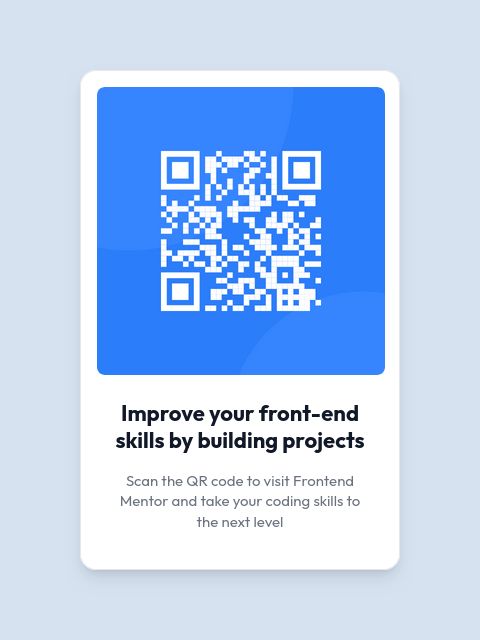

# Frontend Mentor - QR Code Component Solution

This is a solution to the [QR Code Component Challenge on Frontend Mentor](https://www.frontendmentor.io/challenges/qr-code-component-iux_sIO_H). Frontend Mentor challenges help you improve your coding skills by building realistic projects.

## Table of contents

- [Overview](#overview)
  - [Screenshot](#screenshot)
  - [Links](#links)
- [My process](#my-process)
  - [Built with](#built-with)
  - [What I learned](#what-i-learned)
- [Author](#author)
- [Acknowledgments](#acknowledgments)

## Overview

### Screenshot

### Links

- Solution URL: [My Source Code for the QR Code Component Challenge](https://github.com/thomasweitzel/frontend-mentor/tree/main/qr-code-component)
- Live Site URL: [My Live Solution for the QR Code Component Challenge](https://pureandroid.com/frontendmentor/qr-code-component/)

## My process

### Built with

- Semantic HTML5 markup
- [Tailwind CSS](https://tailwindcss.com/) 3.0 utility classes
- [React](https://reactjs.org/) - JS library
- [Rsbuild](https://rsbuild.dev/) - Rspack Powered Build Tool

### What I learned

As a backend developer primarily working with Node.js, Rust, Java, Kotlin, and SQL, this project was an opportunity to
expand my skill set into frontend technologies. While I had some knowledge of HTML and CSS and had previously
experimented with React, I hadn't delved deeply into using these tools together in a structured project.

- React Setup: I decided to use React for all my Frontend Mentor projects to familiarize myself with building reusable
  components.
- Rsbuild vs. Vite: Instead of the popular Vite, I opted for Rsbuild, as it's Rust-powered and aligns with my interests.
- Tailwind CSS: I found Tailwind CSS to be incredibly efficient for managing styles.
- Custom Deployment: I set up my own server for live demos of solutions, learning more about deploying static frontend
  projects.

By integrating these tools, I’ve created a workflow that I plan to refine and reuse for future challenges. This process
has been a rewarding learning experience that will undoubtedly benefit future projects.

## Author

- Website - [Thomas Weitzel](https://weitzel.dev/)
- Frontend Mentor - [@thomasweitzel](https://www.frontendmentor.io/profile/thomasweitzel)
- BlueSky - [@weitzel.dev](https://bsky.app/profile/weitzel.dev)

## Acknowledgments

I'm grateful that YouTube exists. There are so many videos that encouraged me to try out new tools and solutions, like:

- [Tailwind CSS](https://tailwindcss.com/)
- [React](https://reactjs.org/)
- [Rsbuild](https://rsbuild.dev/)
