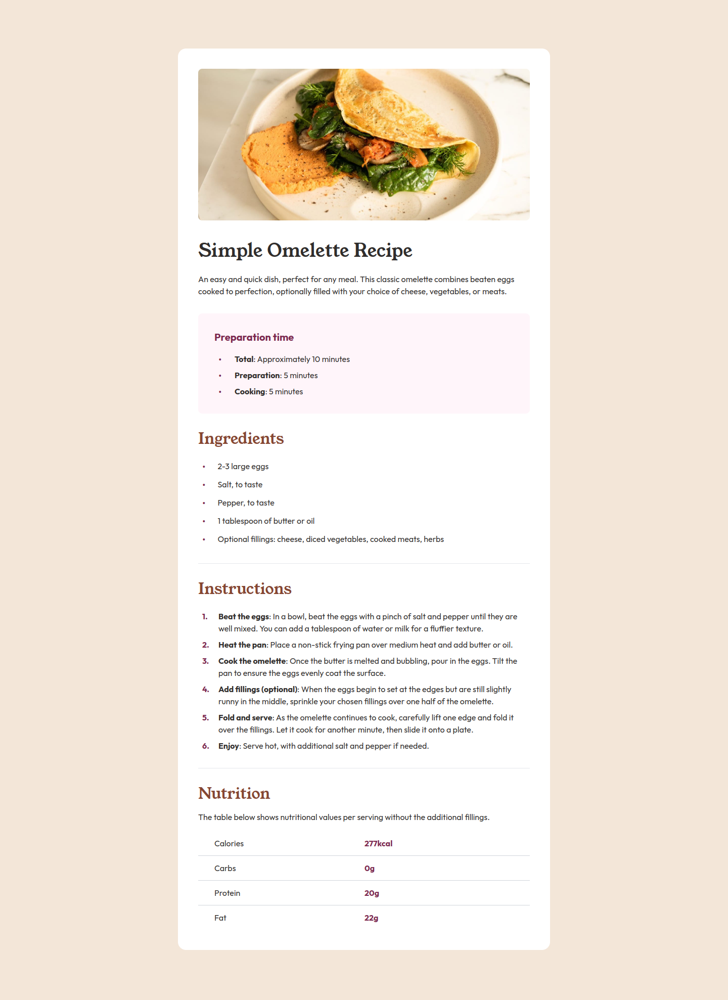

# Frontend Mentor - Recipe Page Solution

This is a solution to
the [Recipe page challenge on Frontend Mentor](https://www.frontendmentor.io/challenges/recipe-page-KiTsR8QQKm).
Frontend Mentor challenges help you improve your coding skills by building realistic projects.

## Table of contents

- [Overview](#overview)
  - [The challenge](#the-challenge)
  - [Screenshot](#screenshot)
  - [Links](#links)
- [My process](#my-process)
  - [Built with](#built-with)
  - [What I learned](#what-i-learned)
- [Author](#author)

## Overview

### Screenshot

### Links

- Solution URL: [Source Code for my Recipe Page Solution](https://github.com/thomasweitzel/frontend-mentor/tree/main/recipe-page)
- Live Site URL: [Live Demo for my Recipe Page Solution](https://pureandroid.com/frontendmentor/recipe-page/)

## My process

### Built with

- Semantic HTML5 markup
- [Tailwind CSS](https://tailwindcss.com/) 3.0 utility classes
- [React](https://reactjs.org/) - JS library
- [Rsbuild](https://rsbuild.dev/) - Rspack Powered Build Tool

### What I learned

- I struggled with the image on top for mobile-mode and desktop-mode:
  whatever I tried, it didn't produce the desired result.
  So I had to think outside the box, i.e. the container.
  I ended up with two images, for which I switched visibility as needed.
  Maybe there's a better solution, which I then failed to find.
- I was thankful for the conditional lines in the table, so I was able to only have these horizontal rulers between
  table rows.
  Not sure if I had found a solution in pure CSS.
- In my eyes, the bullet points in the designs look awful.
  When I read, my eye looks for the bullet point and tries to start reading immediately right from it.
  But the designs had the bullet points horizontally centered for the text block.
  I changed that. The given designs are not always good!

## Author

- Website - [Thomas Weitzel](https://weitzel.dev/)
- Frontend Mentor - [@thomasweitzel](https://www.frontendmentor.io/profile/thomasweitzel)
- BlueSky - [@weitzel.dev](https://bsky.app/profile/weitzel.dev)
