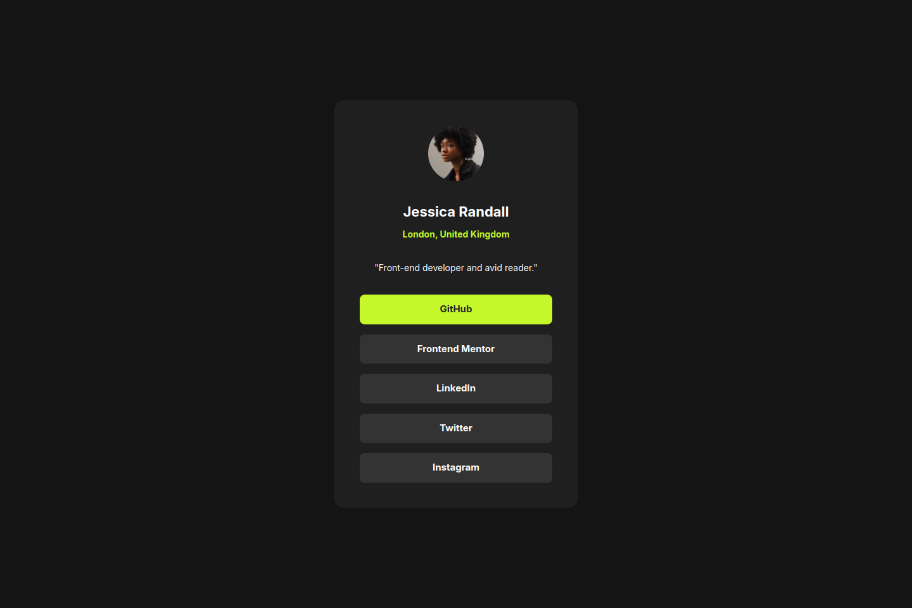

# Frontend Mentor - Social Links Profile Solution

This is a solution to
the [Social links profile challenge on Frontend Mentor](https://www.frontendmentor.io/challenges/social-links-profile-UG32l9m6dQ).
Frontend Mentor challenges help you improve your coding skills by building realistic projects.

## Table of contents

- [Overview](#overview)
  - [The challenge](#the-challenge)
  - [Screenshot](#screenshot)
  - [Links](#links)
- [My process](#my-process)
  - [Built with](#built-with)
  - [What I learned](#what-i-learned)
- [Author](#author)

## Overview

### The challenge

Users should be able to:

- See hover and focus states for all interactive elements on the page

### Screenshot

### Links

- Solution URL: [Source Code for my Social Links Profile Solution](https://github.com/thomasweitzel/frontend-mentor/tree/main/social-links-profile)
- Live Site URL: [Live Demo for my Social Links Profile Solution](https://pureandroid.com/frontendmentor/social-links-profile/)

## My process

### Built with

- Semantic HTML5 markup
- Flexbox
- Mobile-first workflow
- [Tailwind CSS](https://tailwindcss.com/) 3.0 utility classes
- [React](https://reactjs.org/) - JS library
- [Rsbuild](https://rsbuild.dev/) - Rspack Powered Build Tool

### What I learned

- How to iterate over the entries of an array in a React component: the different social platforms in this challenge
- That if I render a list, each entry must have a `key` as a unique identifier
- reinforced use of breakpoint modifiers

## Author

- Website - [Thomas Weitzel](https://weitzel.dev/)
- Frontend Mentor - [@thomasweitzel](https://www.frontendmentor.io/profile/thomasweitzel)
- BlueSky - [@weitzel.dev](https://bsky.app/profile/weitzel.dev)

## Feedback

I received a review from [Adriano](https://www.frontendmentor.io/profile/AdrianoEscarabote).
I did not have the social media buttons in an unordered list, but as a collection of `<a>` elements in a `
`.
He suggested doing this instead:

> [...] consider using the &lt;ul> (unordered list) element  
> to group related links. The &lt;ul> tag is ideal for  
> representing collections, such as a list  
> of social media links or navigation items.

This is a better solution indeed.
I have updated my code to reflect his suggestion.
